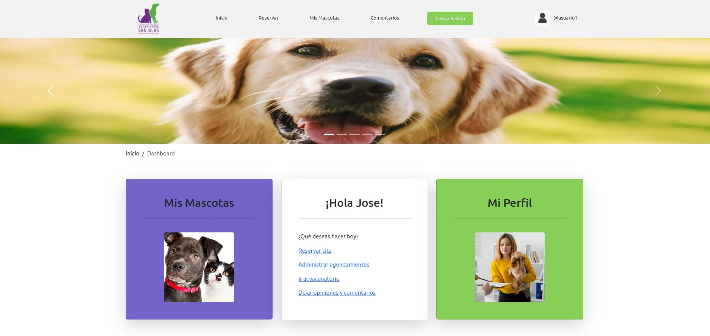
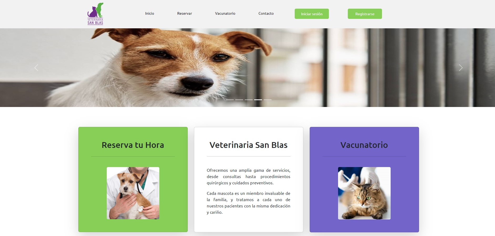
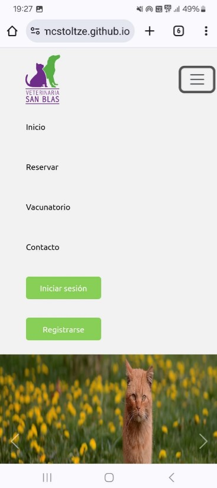
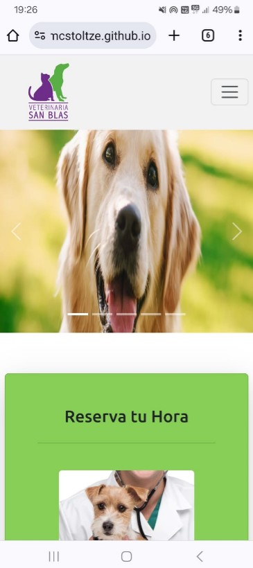
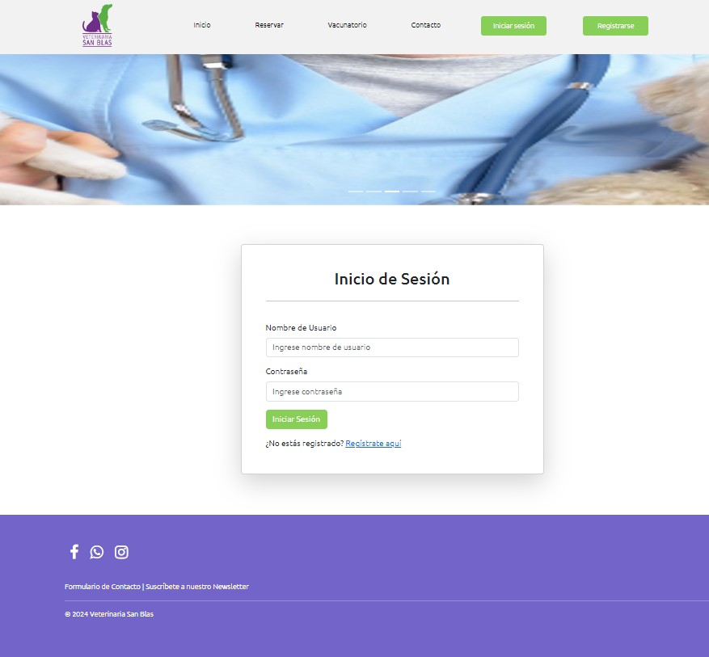

# Veterinaria San Blas

Prototipo de aplicación web desarrollado para Veterinaria San Blas. Desarrollado con Python, Django y PostgreSQL.

Disponible en [https://veterinaria-san-blas.onrender.com/]

## Descripción

Es una aplicación diseñada para gestionar diversos aspectos de la atención veterinaria, incluyendo el registro de mascotas, citas médicas, gestión de fechas de vacunaciones, entre otros.

## Screenshots







## Instalación

1. Clonar el repositorio:

    ```sh
    git clone https://github.com/usuario/proyecto-veterinaria-san-blas.git
    ```

2. Crear y activar un entorno virtual:

    ```sh
    python -m venv venv
    source venv/bin/activate  # En Windows usa `venv\Scripts\activate`
    ```

3. Instalar las dependencias:

    ```sh
    pip install -r requirements.txt
    ```

4. Configurar la base de datos:

    ```sh
    python manage.py migrate
    ```

5. Crear un superusuario:

    ```sh
    python manage.py createsuperuser
    ```

6. Ejecutar el servidor de desarrollo:

    ```sh
    python manage.py runserver
    ```

## Uso

Una vez que el servidor esté en funcionamiento, puede acceder a la aplicación a través de su navegador web en `http://localhost:8000`.

NOTA: La rama main está configurada paera ser montada en servidor; la rama staging para base de datos en servidor y ejecución local; la rama develop para ejecución local con db local en PostgreSQL.

## Autor

José Contreras Stoltze
